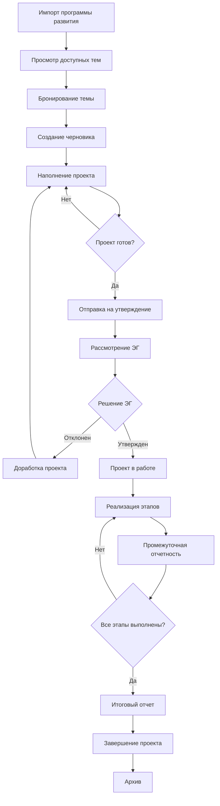

# Техническое задание
## Модуль управления стратегическими проектами для АС ПД

---

## 1. Общая информация

### 1.1 Наименование проекта
**АС ПД** - Автоматизированная Система Проектной Деятельности  
**Модуль**: Стратегические проекты (СтрПр)

### 1.2 Цель разработки
Разработка модуля управления "Стратегическими проектами" для системы управления проектной деятельностью. Модуль должен позволять создавать, сопровождать, утверждать, реализовывать, учитывать и архивировать стратегические проекты, а также формировать по ним отчеты.

### 1.3 Связь с системой
- Модуль реализуется как отдельная подсистема в рамках АС ПД
- Использует общие механизмы аутентификации, управления ролями (RBAC, Yii2)
- Интегрируется с системами нотификаций, тикетов и управления пользователями
- Модуль не формирует зависимостей для других частей системы

### 1.4 Сокращения и термины
- **СтрПр** - стратегические проекты
- **ПрРаз** - Программа развития
- **ЭГ** - экспертная группа
- **ЛК** - личный кабинет пользователя
- **ПФ** - печатная форма
- **ППС** - профессорско-преподавательский состав

---

## 2. Требования к функциональности

### 2.1 Основные функциональные требования

#### 2.1.1 Управление программой развития
- Импорт программы развития из файлов (.csv, .xls, .xml)
- Просмотр доступных тем и направлений проектов
- Поиск и фильтрация по темам/направлениям
- Бронирование тем для создания проектов
- Управление статусами тем (свободно/занято)

#### 2.1.2 Создание и управление проектами
- Автоматическое создание черновика проекта на основе выбранной темы
- Заполнение проектной документации
- Создание плана-графика с этапами
- Управление бюджетом проекта (при необходимости)
- Назначение исполнителей и ответственных

#### 2.1.3 Процесс утверждения
- Отправка проекта на рассмотрение экспертной группы
- Рассмотрение и утверждение/отклонение проектов
- Обработка замечаний и доработка проектов
- Автоматические уведомления участников процесса

#### 2.1.4 Реализация проектов
- Ведение статусов этапов проекта
- Прикрепление результатов и документов
- Создание промежуточных и итоговых отчетов
- Контроль сроков выполнения
- Корректировка планов проектов

#### 2.1.5 Отчетность и архивирование
- Формирование печатных форм отчетов
- Выгрузка истории изменений
- Архивирование завершенных проектов
- Просмотр занятости сотрудников

---

## 3. Роли пользователей и права доступа

### 3.1 Администратор СтрПр
**Права доступа:**
- Импорт/обновление программы развития
- Управление всеми проектами
- Просмотр занятости сотрудников
- Доступ к архивным данным
- Управление пользователями модуля

### 3.2 Куратор СтрПр
**Права доступа:**
- Импорт/обновление программы развития
- Согласование этапов и отчетов
- Просмотр проектов в работе
- Просмотр занятости сотрудников

### 3.3 Экспертная группа (ЭГ)
**Права доступа:**
- Рассмотрение проектов на утверждении
- Утверждение/отклонение проектов
- Просмотр всех проектов
- Согласование корректировок планов

### 3.4 Руководитель ЭГ
**Права доступа:**
- Все права участника ЭГ
- Координация работы экспертной группы
- Принятие финальных решений по проектам

### 3.5 Руководитель проекта (ППС)
**Права доступа:**
- Просмотр программы развития (только свободные темы)
- Бронирование тем и создание проектов
- Редактирование черновиков проектов
- Отправка проектов на утверждение
- Ведение реализации своих проектов
- Создание отчетов

### 3.6 Заказчик проекта
**Права доступа:**
- Просмотр назначенных проектов
- Согласование этапов и отчетов
- Получение уведомлений о статусе проектов

---

## 4. Детальное описание процессов

### 4.1 Жизненный цикл стратегического проекта

### 4.2 Подробное описание этапов

#### 4.2.1 Импорт/обновление программы развития
**Участники:** Администратор СтрПр, Куратор СтрПр

**Действия:**
1. Переход в раздел "Программа развития"
2. Выбор файла для загрузки (.csv формат)
3. Валидация данных
4. Импорт в систему
5. При ошибках - отображение детального отчета

**Результат:** Обновленная программа развития доступна для работы

#### 4.2.2 Создание стратегического проекта
**Участники:** Руководитель проекта (ППС)

**Действия:**
1. Просмотр доступных тем в программе развития
2. Использование фильтра "Только свободные темы"
3. Поиск по критериям
4. Выбор темы → "Забронировать/Создать проект"
5. Подтверждение действия

**Автоматические действия системы:**
- Создание черновика проекта
- Автозаполнение полей:
  - Руководитель: текущий пользователь
  - Сроки: из программы развития
  - Название: код направления + номер темы + год + инициалы ФИО + тема
  - Код направления из программы развития

**Результат:** Создан черновик проекта, пользователь перенаправлен на страницу редактирования

#### 4.2.3 Наполнение черновика проекта
**Участники:** Руководитель проекта

**Основная информация:**
- Цель проекта (текстовое поле)
- Задачи проекта (текстовое поле)
- Куратор проекта (выбор из списка)
- Заказчик проекта (выбор из списка)
- Планируемые результаты (текстовые поля + выпадающий список)
- Сроки проекта (редактируемые даты)
- Требуется бюджет (флажок)

**План-график проекта:**
Для каждого этапа указывается:
- Наименование этапа
- Даты начала и окончания
- Ожидаемые результаты (из справочника)
- Целевые показатели (из справочника)
- Исполнители (выбор пользователей)
- Бюджет этапа (если включена опция бюджетирования)

**Доступные действия:**
- Сохранение изменений
- Просмотр проекта
- Удаление черновика
- Отправка на утверждение (при полном заполнении)

#### 4.2.4 Процесс утверждения
**Участники:** Экспертная группа, Куратор СтрПр, Администратор СтрПр

**Последовательность действий:**
1. Получение уведомления о новом проекте на утверждении
2. Открытие проекта из дашборда "На утверждении"
3. Изучение всех разделов проекта
4. Принятие решения:
   - **Утвердить:** проект переходит в статус "В работе"
   - **Отклонить:** указание комментария, возврат на доработку

**При отклонении:**
- Руководитель получает уведомление
- Проект доступен для редактирования
- После исправлений возможна повторная отправка

#### 4.2.5 Реализация проекта
**Участники:** Руководитель проекта, Исполнители, Куратор, Заказчик

**Ведение этапов:**
- Отметка о начале/завершении этапов
- Прикрепление результатов (файлы, ссылки)
- Загрузка документов

**Промежуточная отчетность:**
- Создание месячных отчетов
- Привязка отчетов к этапам
- Отправка на согласование куратору/заказчику
- Обработка замечаний

**Корректировка планов:**
- Запрос на изменение плана
- Указание изменяемых параметров (сроки, бюджет, исполнители)
- Согласование изменений

#### 4.2.6 Завершение проекта
**Участники:** Руководитель проекта, Куратор

**Действия:**
1. Загрузка итогового отчета
2. Заполнение формы итогового отчета
3. Отправка на согласование
4. Согласование и перевод в статус "Завершен"
5. Перемещение в архив

---

## 5. Основные сущности системы

### 5.1 Программа развития (ПрРаз)
**Атрибуты:**
- ID программы
- Название программы
- Год программы
- Дата создания/обновления
- Статус программы

**Связанные сущности:**
- Темы/направления программы развития

### 5.2 Тема/Направление программы развития
**Атрибуты:**
- ID темы
- Код направления
- Номер темы
- Наименование темы
- Описание
- Плановые сроки реализации
- Ожидаемые результаты (массив)
- Статус (свободно/занято)
- ID связанного проекта (если занято)

### 5.3 Стратегический проект
**Атрибуты:**
- ID проекта
- Название проекта
- Код проекта (автогенерируемый)
- ID темы программы развития
- Руководитель проекта (ID пользователя)
- Куратор проекта (ID пользователя)
- Заказчик проекта (ID пользователя)
- Цель проекта
- Задачи проекта
- Планируемые результаты
- Дата создания
- Плановые сроки (начало/окончание)
- Фактические сроки (начало/окончание)
- Статус проекта
- Требуется бюджет (boolean)
- Общий бюджет
- История изменений

**Статусы проекта:**
- Черновик
- На утверждении
- Отклонен
- Утвержден
- В работе
- Завершен
- Архив

### 5.4 Этап проекта
**Атрибуты:**
- ID этапа
- ID проекта
- Наименование этапа
- Описание
- Дата начала (план/факт)
- Дата окончания (план/факт)
- Статус этапа
- Ожидаемые результаты
- Целевые показатели
- Бюджет этапа
- Порядковый номер

**Связанные сущности:**
- Исполнители этапа
- Результаты этапа
- Отчеты по этапу

### 5.5 Исполнитель этапа
**Атрибуты:**
- ID записи
- ID этапа
- ID пользователя
- Роль в этапе
- Дата назначения

### 5.6 Отчет
**Атрибуты:**
- ID отчета
- ID проекта
- ID этапа (для промежуточных отчетов)
- Тип отчета (месячный/итоговый)
- Дата создания
- Содержание отчета
- Статус согласования
- Комментарии
- Прикрепленные файлы

### 5.7 Результат этапа
**Атрибуты:**
- ID результата
- ID этапа
- Описание результата
- Тип результата
- Файлы/ссылки
- Дата добавления

---

## 6. Пользовательский интерфейс

### 6.1 Главное меню модуля
- Программа развития
- Мои проекты
- На утверждении (для ЭГ)
- Проекты в работе
- Занятость сотрудников
- Архив проектов

### 6.2 Программа развития
**Элементы интерфейса:**
- Кнопка "Загрузить программу из файла"
- Фильтр "Только свободные темы"
- Поисковая строка
- Фильтры по критериям
- Таблица тем с колонками:
  - Код направления
  - Номер темы
  - Наименование
  - Сроки реализации
  - Статус
  - Действия (Забронировать/Просмотреть)

### 6.3 Карточка проекта
**Вкладки:**
- Общая информация
- План-график
- Отчеты
- Результаты
- История изменений

**Кнопки действий (в зависимости от статуса и роли):**
- Редактировать
- Удалить черновик
- Отправить на утверждение
- Утвердить/Отклонить
- Запустить проект
- Добавить результат
- Создать отчет
- Завершить проект
- Сформировать печатную форму

### 6.4 Дашборды
**Дашборд "На утверждении":**
- Список проектов ожидающих решения
- Фильтры по датам подачи
- Быстрые действия

**Дашборд "Мои проекты":**
- Группировка по статусам
- Индикаторы просроченных сроков
- Быстрый переход к действиям

---

## 8. Функциональные сценарии (User Stories)

### 8.1 Администратор СтрПр
**Как администратор, я хочу:**
- Загрузить новую программу развития из CSV файла
- Видеть все проекты в системе независимо от статуса
- Управлять правами доступа пользователей к модулю
- Получать отчеты о загрузке системы и активности пользователей

### 8.2 Руководитель проекта (ППС)
**Как руководитель проекта, я хочу:**
- Найти подходящую тему в программе развития
- Создать проект на основе выбранной темы
- Заполнить план реализации проекта
- Отслеживать статус утверждения проекта
- Вести отчетность по этапам проекта
- Корректировать план при необходимости

### 8.3 Член экспертной группы
**Как член ЭГ, я хочу:**
- Видеть все проекты, поданные на утверждение
- Изучить детали проекта перед принятием решения
- Оставлять комментарии при отклонении проекта
- Отслеживать статус проектов после утверждения

### 8.4 Куратор проекта
**Как куратор, я хочу:**
- Получать уведомления о назначении куратором проекта
- Согласовывать промежуточные отчеты
- Видеть прогресс выполнения проекта
- Контролировать соблюдение сроков

---

## 11. Критерии приемки

### 11.1 Функциональные критерии
- [ ] Успешный импорт программы развития из CSV файла
- [ ] Создание проекта на основе темы программы развития
- [ ] Полный цикл утверждения проекта
- [ ] Ведение реализации проекта с отчетностью
- [ ] Генерация печатных форм отчетов
- [ ] Архивирование завершенных проектов

### 11.2 Технические критерии
- [ ] Система работает во всех поддерживаемых браузерах
- [ ] Время отклика не превышает 3 секунд
- [ ] Все пользовательские действия логируются
- [ ] Интеграция с системой аутентификации АС ПД работает корректно
- [ ] Система уведомлений функционирует правильно

### 11.3 Критерии качества
- [ ] Пройдено тестирование безопасности
- [ ] Проведено нагрузочное тестирование
- [ ] Создана техническая документация
- [ ] Обучены ключевые пользователи системы

---